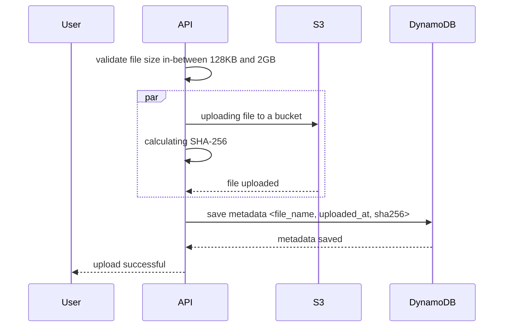
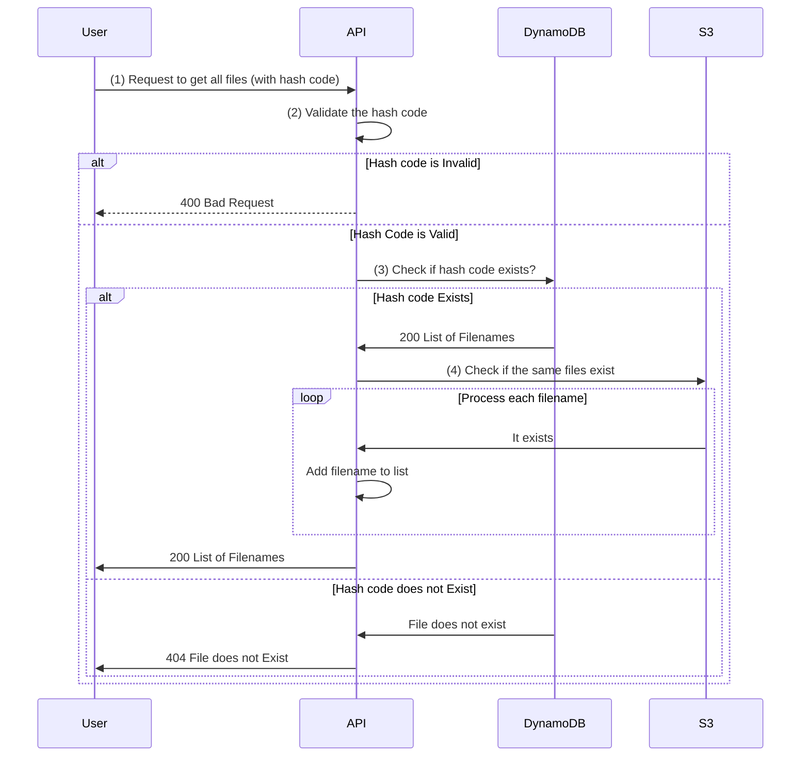
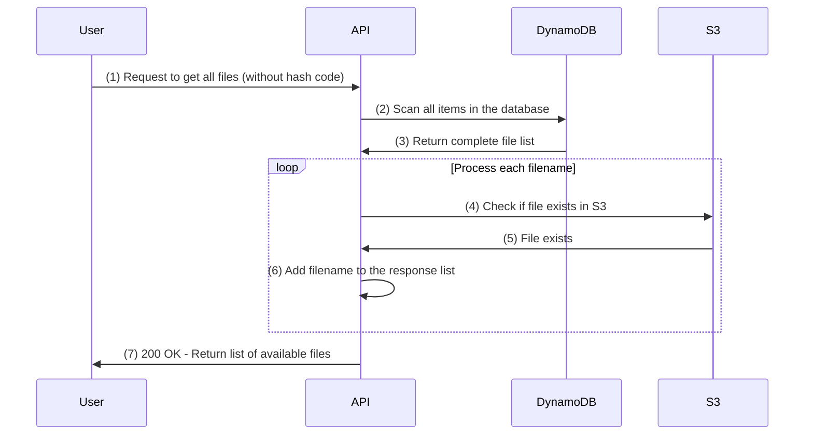
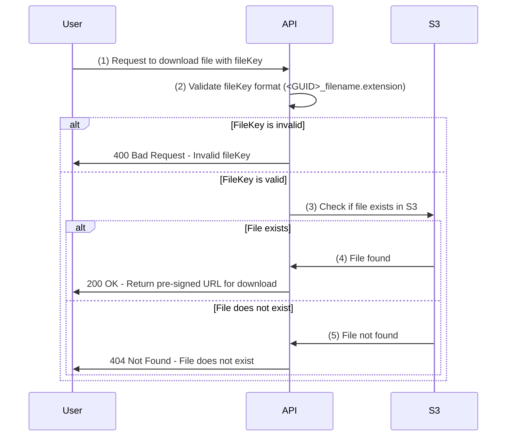

# File Storage System

This is application integrates with AWS services to `upload`, `retrieve` and `list` all stored files in AWS. It leverages **LocalStack** a fully functional local AWS cloud stack to simulate AWS services locally during development.

### 📌 Key Features

- 🍀 **Resilient File Upload** to AWS storage S3 Bucket.
- 🍀 **Efficient Retrieves** stored files from S3 Bucket.
- 🍀 **Lists all stored files** for easy management and retrieval from S3.
- 🍀 **SHA-256 Hashing**: calculates and stores the SHA-256 hash of each uploaded file to DynamoDB, ensuring file integrity and traceability.

The application exposes a set of **REST API** endpoints written in C#, which handles the communication with AWS services. These endpoints allow seamless integration with AWS services in a local development environment or in production.

## Table of Contents

- [Problem Statement](#-problem-statement)
- [Services Used](#-aws-services-used)
- [Installation](#️-installations)
- [Folder Structure](#folder-structure)
- [Implementation Details](#️-implementation-details)
  - [Upload File](#-upload)
    1. [Sequence Diagram](#-the-sequence-diagram-for-the-upload-process-is-given-below--)
  - [Download File](#-download-file)
    1. [Sequence Diagram](#-the-sequence-diagram-when-downloads-a-file-with-a-valid-file-key)
  - [List Files](#-list-all-files)
    1. [Sequence Diagram - With HashCode](#-the-sequence-diagram-when-user-provides-a-hash-code)
    2. [Sequence Diagram - All Files](#-the-below-sequence-diagram-explains-the-case-when-user-does-not-provide-a-hash-code)
- [API Endpoints](#-api-endpoints)
- [Assumptions](#assumptions)
- [Tests](#tests)
- [Problems it Solves](#problems-it-solves)
- [License](#license)

## 🔗 Problem-Statement

| Feature           | Status | Description                                                                                                                                                                                                                                                                                                                                                                                                                                                                                                                                                                                                                                                                                                 |
| ----------------- | ------ | ----------------------------------------------------------------------------------------------------------------------------------------------------------------------------------------------------------------------------------------------------------------------------------------------------------------------------------------------------------------------------------------------------------------------------------------------------------------------------------------------------------------------------------------------------------------------------------------------------------------------------------------------------------------------------------------------------------- |
| **Upload file**   | ✅     | A a user,wants to upload a file to S3 for long-term storage. The file can be any size from 128KB to 2GB. Unfortunately, user has a slow internet connection, and sometimes there might be network interruptions, despite that the application should be able to upload files efficiently. Along with uploading the file, user wants to calculate its SHA-256 value and store it in DynamoDB for further analysis. Two important points to consider:<br/>1. Memory used: User has small servers which cannot have more than 2GB of memory.<br/>2. Security: For security reasons, the whole file cannot be stored in the memory, even for a fraction of a second (e.g., even minimum size files like 128KB). |
| **Download file** | ❌     | User wants to download a file that was previously uploaded by them or any other user. The download process should be resilient to network interruptions within 10 seconds, if possible.                                                                                                                                                                                                                                                                                                                                                                                                                                                                                                                     |
| **List files**    | ❌     | The user wants to list all files and find specific files using their SHA-256 values. The logic should handle cases where the file was deleted from S3, but the DynamoDB record still exists. It is acceptable to have an inconsistent state for a short time when a file was deleted during a request.                                                                                                                                                                                                                                                                                                                                                                                                      |

## ✅ AWS Services Used

- S3 Bucket
- DynamoDB
- LocalStack
- AWS SDK for .NET

## 🛠️ Installations

Pre-requirements:

- AWS CLI
- Docker
- .NET SDK 8.0+
- make
- jq

### Setup

To setup the project and all needed dependencies:

```sh
make up
```

To test if everything is ready (DynamoDB and S3 are created):

```sh
make check
```

If everything worked fine (localstack takes a bit time to prepare), you should see the following output from
`make check` command:

```
*** You might see your own AWS resources below, if you have localstack installed before ***
DynamoDB Table: Files
S3 Bucket: storage
FileStorage API: Healthy
*******************************************************************************************
```

### Additional Commands

To restart localstack resources (and empty them) as well as building the docker image for `filestorage-api` container

```sh
make reset
```

To stop all containers

```sh
make down
```

To check logs from containers

```sh
make logs
```

To check all stored S3 files and DynamoDB items

```sh
make storage
```

## 📂 Folder Structure

```
📂 FileStorage
│
├─── 📂 Controllers
│     ├─── 📄 FileStorageController.cs
│     │
├─── 📂 Properties
│     ├─── 📄 launchSettings.json
│     │
├─── 📂 Services
│     ├─── 📂 DTO
│     │     ├─── 📄 DownloadFileDto.cs
│     │     ├─── 📄 LisFileDto.cs
│     │     ├─── 📄 ShaResponseDto.cs
│     │     ├─── 📄 UploadFileDto.cs
│     │     │
│     ├─── 📂 Implementation
│     │     ├─── 📄 IFileStorageService.cs
│     │     ├─── 📄 FileStorageService.cs
│     │     │
│     ├─── 📂 Shared
│     │     ├─── 📄 MaxFileSizeAttribute.cs
│     │     ├─── 📄 MinFileSizeAttribute.cs
│     │     ├─── 📄 ValidateFileKeys.cs
│     │     ├─── 📄 ValidateHashCode.cs
│     │     │
│     ├─── 📂 ValueObject
│     │     ├─── 📄 Status.cs
│     │
├─── 📂 Tests
│     ├─── 📄 FileStorageServiceTests.cs
│
├─── 📄 .dockerignore
├─── 📄 appsettings.development.json
├─── 📄 appsettings.json
├─── 📄 Dockerfile
├─── 📄 FileStorage.csproj
├─── 📄 FileStorage.sln
├─── 📄 Program.cs
├─── 📄 .gitignore
├─── 📄 README.md

```

## ⭐️ Implementation-Details

#### 🚀 Upload

The application supports resilient uploading files with the following characteristics:

| Feature               | Description                                                                                                      |
| --------------------- | ---------------------------------------------------------------------------------------------------------------- |
| **File Size Range**   | 128KB to 2GB                                                                                                     |
| **Memory Management** | Files are streamed directly to S3, ensuring that nothing is stored in memory.                                    |
| **Data Transfer**     | Files are uploaded using AWS S3's TransferUtility method.                                                        |
| **Multipart Upload**  | Automatically handles large files (default part size is 5MB).                                                    |
| **Hash Calculation**  | SHA-256 hash is calculated for data chunks during the upload process.                                            |
| **DynamoDB Storage**  | The SHA-256 hash is stored in DynamoDB with the following structure:                                             |
|                       | - **Filename**: Partition key.<br/>- **UploadedAt**: Sort key.<br/> - **FileHash**: Global Secondary Index (GSI) |
|                       |                                                                                                                  |

### Sequence Diagram

#### 🟢 The sequence diagram for the upload process is given below -



### 📋 List All Files

The application supports Listing file details with the following characteristics:

| Feature                     | Description                                                                                            |
| --------------------------- | ------------------------------------------------------------------------------------------------------ |
| **Listing All files**       | List all file details which are present in both dynamodb and S3                                        |
| **Data Retrieval Strategy** | Details are retrieved in batches of 100 to prevent hitting S3’s 1MB byte range limitation per request. |
| **Find Specific file**      | Gets the file details with `SHA-256` which are present in both dynamodb and S3                         |
|                             |                                                                                                        |

### Sequence Diagram

> Note: To view the diagram below, you may need to install the **Mermaid** plugin for your editor.
> The sequence diagram for the list all files process is given below -

#### 🟢 The sequence diagram when user provides a hash code



---

#### 🟢 The below sequence diagram explains the case when user does not provide a hash code



---

### 📄 Download File

> Note: To view the diagram below, you may need to install the **Mermaid** plugin for your editor.
> The application supports downloading file with the following characteristics:

| Feature                                | Description                                                                                           |
| -------------------------------------- | ----------------------------------------------------------------------------------------------------- |
| **Download file with a pre-signed UR** | Provides a time-limited link for downloading the file, granting access for a specified duration.      |
| **Data Retrieval Strategy**            | A link to download the file is provided which is downloaded directly to the client's browser.         |
| **Memory Management**                  | Ensures minimal server load by streaming files directly to the client without storing them in memory. |
|                                        |                                                                                                       |

### Sequence Diagram

> Note: To view the diagram below, you may need to install the **Mermaid** plugin for your editor.
> The sequence diagram for downloading a file is given below -

#### 🟢 The sequence diagram when downloads a file with a valid file key



## 🌐 API EndPoints

All the APIs start with `/api/filestorage/ActionName`.

For example:

1. To upload a file to S3, send a POST request to the following URL using Postman:  
   `https://localhost:8080/api/filestorage/upload`
2. To check the application's health, simply navigate to this URL in your browser:  
   `https://localhost:8080/health`

| HTTP Method | Endpoint                        | Description                                            | Parameter - Type | Parameter - IsOptional |
| ----------- | ------------------------------- | ------------------------------------------------------ | ---------------- | ---------------------- |
| GET         | /filestorage/listfiles?HashCode | Lists all file details or list a item detail           | Query            | Yes ✅                 |
| GET         | /filestorage/download/:fileKey  | Gets the link to download the file to client's browser | Route            | No ❌                  |
| POST        | /filestorage/upload             | Uploads the file to S3 and uploads the sha to dynamodb | Body             | No ❌                  |

## 🙋🏻‍♀️ Assumptions

- Authentication / Authorization are not a part of this application yet.

#### List All Files Method

A single route is used for both listing all files and listing one file details by hashcode.

##### WHY

1.  The logic for both operations is the same.
2.  Avoiding redundancy.

##### Solution

- An optional query parameter is used:
  - If the hashcode is provided, it is validated first.
  - If valid, the system checks if the item exists in S3 bucket.
  - If invalid a BadRequest response is sent to the user.
  - If the valid item exists in S3, then API retrieves the details and sends it back to the user.

---

#### Download File Method

The method used for downloading files is **Pre-signed URLs**.

##### WHY?

1. The servers are small, and directly downloading the file to the server is not a feasible option.
2. The goal is to stream the file directly to the client's browser, reducing the load on the server.
3. Pre-signed URLs allow the browser to handle the download, enabling it to resume in case of network failure.

##### Solution

- Files are streamed directly to the client's browser.
- **Pre-signed URLs** offload the server and provide enhanced security by expiring after a specified time (e.g., 30 minutes).
- These URLs can also be configured with **Access Control Lists (ACLs)** to define who has access to the file.
