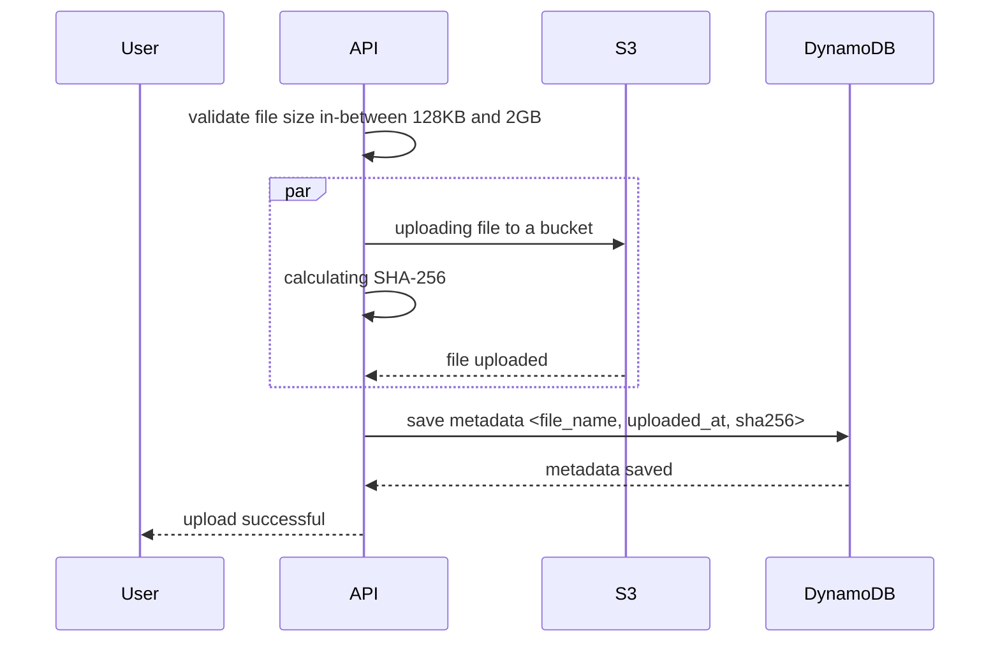
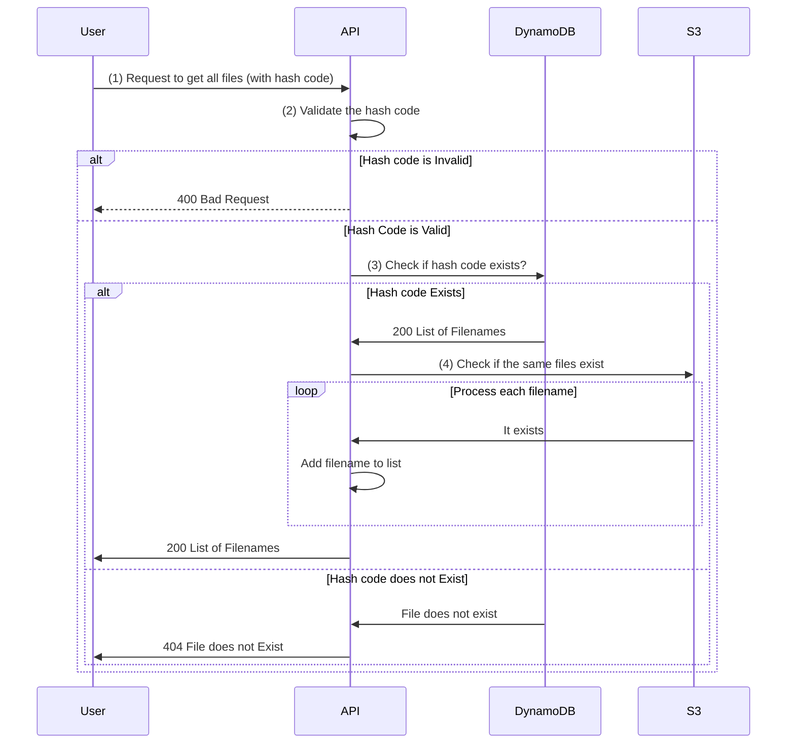
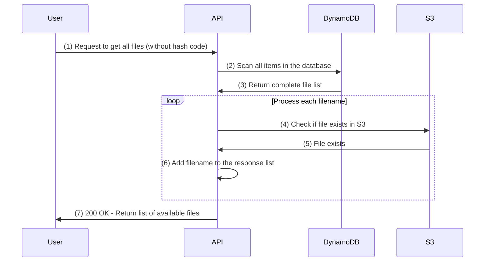
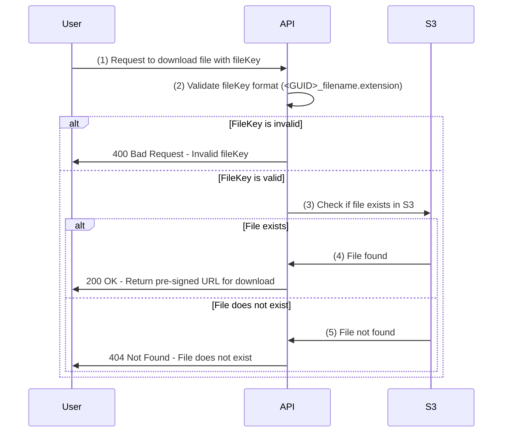

# File Storage System


This is application integrates with AWS services to `upload`, `retrieve` and `list` all stored files in AWS. It leverages **LocalStack** a fully functional local AWS cloud stack to simulate AWS services locally during development.

### 📌 Key Features

- 🍀 **Resilient File Upload** to AWS storage S3 Bucket.
- 🍀 **Efficiently Retrieves** from files stored in S3 Bucket.
- 🍀 **Lists all stored files** for easy management and retrieval from S3.
- 🍀 **SHA-256 Hashing**: calculates and stores the SHA-256 hash of each uploaded file to DynamoDB, ensuring file integrity and traceability.

The application exposes a set of **REST API** endpoints written in C#, which handles the communication with AWS services. These endpoints allow seamless integration with AWS services in a local development environment or in production.

## Table of Contents

- [Requirements](#-requirements)
- [Services Used](#-aws-services-used)
- [Installation](#️-installations)
- [Folder Structure](#folder-structure)
- [Implementation Details](#️-implementation-details)
  - [Upload File](#-upload)
    1. [Sequence Diagram](#-the-sequence-diagram-for-the-upload-process-is-given-below--)
  - [Download File](#-download-file)
    1. [Sequence Diagram](#-the-sequence-diagram-when-downloads-a-file-with-a-valid-file-key)
  - [List Files](#-list-all-files)
    1. [Sequence Diagram - With HashCode](#-the-sequence-diagram-when-user-provides-a-hash-code)
    2. [Sequence Diagram - All Files](#-the-below-sequence-diagram-explains-the-case-when-user-does-not-provide-a-hash-code)
- [API Endpoints](#-api-endpoints)
- [API Request-Response Reference](#-api-request-response-reference)
- [Assumptions](#️-assumptions)
  1. [General](#-general)
  2. [Methods](#-methods)
- [Test Simulation](#-test-simulation)

## 🔗 Requirements

| Feature           | IsRequired | Description                                                                                                                                                                                                                                                                                                                                                                                                                                                                                                                                                                                                                                                                                                 |
| ----------------- | ---------- | ----------------------------------------------------------------------------------------------------------------------------------------------------------------------------------------------------------------------------------------------------------------------------------------------------------------------------------------------------------------------------------------------------------------------------------------------------------------------------------------------------------------------------------------------------------------------------------------------------------------------------------------------------------------------------------------------------------- |
| **Upload file**   | ✅         | A a user,wants to upload a file to S3 for long-term storage. The file can be any size from 128KB to 2GB. Unfortunately, user has a slow internet connection, and sometimes there might be network interruptions, despite that the application should be able to upload files efficiently. Along with uploading the file, user wants to calculate its SHA-256 value and store it in DynamoDB for further analysis. Two important points to consider:<br/>1. Memory used: User has small servers which cannot have more than 2GB of memory.<br/>2. Security: For security reasons, the whole file cannot be stored in the memory, even for a fraction of a second (e.g., even minimum size files like 128KB). |
| **Download file** | ❌         | User wants to download a file that was previously uploaded by them or any other user. The download process should be resilient to network interruptions within 10 seconds, if possible.                                                                                                                                                                                                                                                                                                                                                                                                                                                                                                                     |
| **List files**    | ❌         | The user wants to list all files and find specific files using their SHA-256 values. The logic should handle cases where the file was deleted from S3, but the DynamoDB record still exists. It is acceptable to have an inconsistent state for a short time when a file was deleted during a request.                                                                                                                                                                                                                                                                                                                                                                                                      |

## ✅ AWS Services Used

- S3 Bucket
- DynamoDB
- Local stack is used to simulate `AWS` environment locally
- AWS SDK for .NET is used to communicate with `AWS` services

## 🛠️ Installations

Pre-requirements:

- AWS CLI
- Docker
- .NET SDK 8.0+
- make
- jq

### Setup

To setup the project and all needed dependencies:

```sh
make up
```

To test if everything is ready (DynamoDB and S3 are created):

```sh
make check
```

If everything worked fine (localstack takes a bit time to prepare), you should see the following output from
`make check` command:

```
*** You might see your own AWS resources below, if you have localstack installed before ***
DynamoDB Table: Files
S3 Bucket: storage
FileStorage API: Healthy
*******************************************************************************************
```

### Additional Commands

To restart localstack resources (and empty them) as well as building the docker image for `filestorage-api` container

```sh
make reset
```

To stop all containers

```sh
make down
```

To check logs from containers

```sh
make logs
```

To check all stored S3 files and DynamoDB items

```sh
make storage
```

## 📂 Folder Structure

```
📂 FileStorage
│
├─── 📂 Controllers
│     ├─── 📄 FileStorageController.cs
│     │
├─── 📂 Properties
│     ├─── 📄 launchSettings.json
│     │
├─── 📂 Services
│     ├─── 📂 DTO
│     │     ├─── 📄 DownloadFileDto.cs
│     │     ├─── 📄 LisFileDto.cs
│     │     ├─── 📄 ShaResponseDto.cs
│     │     ├─── 📄 UploadFileDto.cs
│     │     │
│     ├─── 📂 Implementation
│     │     ├─── 📄 IFileStorageService.cs
│     │     ├─── 📄 FileStorageService.cs
│     │     │
│     ├─── 📂 Shared
│     │     ├─── 📄 MaxFileSizeAttribute.cs
│     │     ├─── 📄 MinFileSizeAttribute.cs
│     │     ├─── 📄 ValidateFileKeys.cs
│     │     ├─── 📄 ValidateHashCode.cs
│     │     │
│     ├─── 📂 ValueObject
│     │     ├─── 📄 Status.cs
│     │
├─── 📂 Tests
│     ├─── 📄 FileStorageServiceTests.cs
│
├─── 📄 .dockerignore
├─── 📄 appsettings.development.json
├─── 📄 appsettings.json
├─── 📄 Dockerfile
├─── 📄 FileStorage.csproj
├─── 📄 FileStorage.sln
├─── 📄 Program.cs
├─── 📄 .gitignore
├─── 📄 README.md

```

## ⭐️ Implementation-Details

#### 🚀 Upload

The application supports resilient uploading files with the following characteristics:

| Feature               | Description                                                                                                      |
| --------------------- | ---------------------------------------------------------------------------------------------------------------- |
| **File Size Range**   | 128KB to 2GB                                                                                                     |
| **Memory Management** | Files are streamed directly to S3, ensuring that nothing is stored in memory.                                    |
| **Data Transfer**     | Files are uploaded using AWS S3's TransferUtility method.                                                        |
| **Multipart Upload**  | Automatically handles large files (default part size is 5MB).                                                    |
| **Hash Calculation**  | SHA-256 hash is calculated for data chunks during the upload process.                                            |
| **DynamoDB Storage**  | The SHA-256 hash is stored in DynamoDB with the following structure:                                             |
|                       | - **Filename**: Partition key.<br/>- **UploadedAt**: Sort key.<br/> - **FileHash**: Global Secondary Index (GSI) |
|                       |                                                                                                                  |

### Sequence Diagram

> The sequence diagram for uploading file process is given below -

#### 🟢 The sequence diagram for the upload process is given below -



### 📋 List All Files

The application supports Listing file details with the following characteristics:

| Feature                     | Description                                                                                            |
| --------------------------- | ------------------------------------------------------------------------------------------------------ |
| **Listing All files**       | List all file details which are present in both dynamodb and S3                                        |
| **Data Retrieval Strategy** | Details are retrieved in batches of 100 to prevent hitting S3’s 1MB byte range limitation per request. |
| **Find Specific file**      | Gets the file details with `SHA-256` which are present in both dynamodb and S3                         |
|                             |                                                                                                        |

### Sequence Diagram

> The sequence diagram for the list all files process is given below -

#### 🟢 The sequence diagram when user provides a hash code



---

#### 🟢 The below sequence diagram explains the case when user does not provide a hash code



---

### 📄 Download File

> Note: The application supports downloading file with the following characteristics:

| Feature                                | Description                                                                                           |
| -------------------------------------- | ----------------------------------------------------------------------------------------------------- |
| **Download file with a pre-signed UR** | Provides a time-limited link for downloading the file, granting access for a specified duration.      |
| **Data Retrieval Strategy**            | A link to download the file is provided which is downloaded directly to the client's browser.         |
| **Memory Management**                  | Ensures minimal server load by streaming files directly to the client without storing them in memory. |
|                                        |                                                                                                       |

### Sequence Diagram

> The sequence diagram for downloading a file is given below -

#### 🟢 The sequence diagram when downloads a file with a valid file key



## 🌐 API EndPoints

All the APIs start with `/api/filestorage/[action name]`.

For example:

1. To upload a file to S3, send a POST request to the following URL using Postman:  
   `https://localhost:8080/api/filestorage/upload`
2. To check the application's health, simply navigate to this URL in your browser:  
   `https://localhost:8080/health`

| HTTP Method | Endpoint                           | Description                                            | Parameter - Type | Parameter - IsOptional |
| ----------- | ---------------------------------- | ------------------------------------------------------ | ---------------- | ---------------------- |
| GET         | /filestorage/listfiles?hashCode    | Lists all file details or list a item detail           | Query            | Yes ✅                 |
| GET         | /filestorage/downloadfile/:fileKey | Gets the link to download the file to client's browser | Route            | No ❌                  |
| GET         | /filestorage/download/:fileKey     | Downloads the file directly to the user browser        | Route            | No ❌                  |
| POST        | /filestorage/upload                | Uploads the file to S3 and uploads the sha to dynamodb | Body             | No ❌                  |

## 📌 API Request-Response Reference

If running from docker the hostname would be -

http://localhost:8080

### 🔷 API Endpoint: List Files by Hash Code

#### Request:

**Method:** `GET`  
**URL:** `/api/filestorage/listfiles?hashCode`

#### Sample Input: For valid hashcode

```
?hashCode=a8b2d1c5f3e4a6b7c9d8e0f1a2b3c4d5e6f7g8h9i0j1k2l3m4n5o6p7q8r9s0t1
```

#### Sample Output:

```json
{
  "Status": "Success",
  "TotalFileCount": 1,
  "Files": [
    {
      "FileName": "f2f913e7-9cba-4e56-91f8-e8c0c9c697f1_document1.txt",
      "FileHash": "a8b2d1c5f3e4a6b7c9d8e0f1a2b3c4d5e6f7g8h9i0j1k2l3m4n5o6p7q8r9s0t1",
      "UploadedAt": "2024-01-30T12:34:56Z"
    }
  ]
}
```

#### All files without a hashCode:

#### Sample Output:

```json
{
  "Status": "Success",
  "TotalFileCount": 1,
  "Files": [
    {
      "FileName": "f2f913e7-9cba-4e56-91f8-e8c0c9c697f1_document1.txt",
      "FileHash": "a8b2d1c5f3e4a6b7c9d8e0f1a2b3c4d5e6f7g8h9i0j1k2l3m4n5o6p7q8r9s0t1",
      "UploadedAt": "2024-01-30T12:34:56Z"
    },
    {
      "FileName": "g2f913e7-9cba-4e56-91f8-e8c0c9c697g8_test1.txt",
      "FileHash": "a94a8fe5ccb19ba61c4c0873d391e987982fbbd3c8a3dfc4d9b4a9e7",
      "UploadedAt": "2024-01-30T12:34:56Z"
    }
  ]
}
```

---

### 🔷 API Endpoint: Upload files to S3

#### Request:

**Method:** `POST`  
**URL:** `/api/filestorage/upload`<br/>
**BODY** `IFormFile`

#### Sample Input:

##### **Body (form-data):**

| Key    | Type | Value                               |
| ------ | ---- | ----------------------------------- |
| `file` | File | (Select a file, e.g., `sample.txt`) |

#### Sample Output:

```json
{
  "Status": "Success",
  "FileHash": "a94a8fe5ccb19ba61c4c0873d391e987982fbbd3c8a3dfc4d9b4a9e7",
  "Message": "File uploaded successfully."
}
```

---

### 🔷 API Endpoint: Download files from S3

#### 1. Request:

**Pre-signedURL**<br>
**Method:** `GET`  
**URL:** `/api/filestorage/downloadfile/f2f913e7-9cba-4e56-91f8-e8c0c9c697f1_document.txt`<br/>

#### Sample Input:

```
download/f2f913e7-9cba-4e56-91f8-e8c0c9c697f1_document.txt
```

#### Sample Output:

```json
{
  "Status": "Success",
  "StatusCode": 200,
  "Message": "File uploaded successfully.",
  "DownloadUrl": "http://localstack:4566/files/document1.pdf?access_key=abc123xyz&expires=2024-02-01T12:00:00Z"
}
```

> Note: The url that is generated for localstack is prefixed with http://localstack:4566 for localstack but to download it from browser need to change localstack to localhost for downloading to begun.

#### 2. Request:

**Direct Streaming**<br>
**Method:** `GET`  
**URL:** `/api/filestorage/download/f2f913e7-9cba-4e56-91f8-e8c0c9c697f1_document.txt`<br/>

#### Sample Input:

```
download/f2f913e7-9cba-4e56-91f8-e8c0c9c697f1_document.txt
```

#### Sample Output:

Downloads the file directly to the browser.

## 🙋🏻‍♀️ Assumptions

### 🪭 General

- `Authentication / Authorization` are not a part of this application yet.
- The folder structure intentionally omits a separate `Core` layer for `Entities` to keep things simple. However, if needed, a dedicated layer for `Entities` can be created later, with models defined alongside appropriate validation attributes.
- I have a `Shared` folder under `Services` folder that contains custom Attributes namely

  1. `MaxFileSizeAttribute`. (Validation Attribute)
  2. `MinFileSizeAttribute`. (Validation Attribute)
  3. `ValidateHashCode`. (ActionFilterAttribute)
  4. `ValidateFileKey`. (ActionFilterAttribute)

- I have kept a separate `ValueObject` folder which contains a Enum called Status for the formatting the DTO's to have Status of the response.

- I have developed and tested the application in localhost. However, when we will use the application to integrate with a frontend application CORS needs to be enabled.

### 🪭 Methods

#### 🏷️ Upload File Method

I am using the TransferUtility class to upload the files.

##### WHY

1.  This works for both small and large files. In case of large files, it does mutlti part upload automatically.

#### 🏷️ List All Files Method

A single route is used for both listing all files and listing one file details by hashcode.

##### WHY

1.  The logic for both operations is the same.
2.  Avoiding redundancy.

##### Solution

- An optional query parameter is used:
  - If the hashcode is provided, it is validated first.
  - If valid, the system checks if the item exists in S3 bucket.
  - If invalid a BadRequest response is sent to the user.
  - If the valid item exists in S3, then API retrieves the details and sends it back to the user.

---

#### 🏷️ Download File Method

So far I have discovered two methods for downloading files <br/> 1. **Pre-signed URLs**. <br/> 2. **Direct Streaming**.<br/>

I have tested and both works. Both can be used depending on the scenarios and requirements as such - <br/>

#### ❇️ Choosing Between Pre-Signed URLs and Direct Streaming

Depending on the **scenario** and **requirements**, both **pre-signed URLs** and **direct streaming** are valid options. Here's a breakdown of when to use each:

---

#### 1. Pre-Signed URLs for Email Sharing

If you need to **send the download link** via email to a user or where we do not want to stress our application server, **pre-signed URLs** are a great choice. These URLs:

- Are **secure** and include an **expiration time**, ensuring temporary access to the file.
- Can be easily shared via **email** without worrying about unauthorized access.
- No stress to application server at all, since it is downloaded from S3 bucket directly.
- Provide **control** over who can download the file and for how long.

**Ideal use case:** When sending files to users in a **secure and controlled manner** via email.

---

#### 2. Direct Streaming for Immediate Access

For situations where the **file needs to be downloaded directly** without requiring a separate link, within client's bowser, **direct streaming** is often the better option. This approach:

- **Streams** the file directly to the user without the need for an extra URL.
- Is **quick** and **efficient**, with no extra steps for the user.
- Does, however, **put some load on the server**, as the file is being processed and streamed in real-time.

**Ideal use case:** When you need to download files without the hassle of links, and server load is not a major concern.

---

#### Which One to Use?

- If you're sending a file link to users, **go with pre-signed URLs** for better **security** and **control** without putting any stress any server load.
- If it's for **quick downloads** or streaming content directly without links, **direct streaming** works well, though keep an eye on **server load**.

---

Feel free to choose the option that best fits your **use case**!

## ✅ Test Simulation

**Upload File Method**

- I have tested simultaneously with 10 hits in parallel uploading files to S3 bucket and approximately it takes 38secs/100MB file upload in my system.
- I have tested with uploading a file with size of 2GB with 2 parallel hits with aprroximately 4 mins/2GB.
- I initially made 5 requests, ensuring that a new request was initiated as soon as one completed. This process continued for 15 requests in total, and for a 100MB file, the total processing time was approximately 39.5 seconds.

**List All Files Method**

- With 2 parallel uploads ongoing, I have tested 5 parallel list all files which approximately takes 2mins/1GB to upload.

**Download File Method**

- I tested downloading 10 files, each 5MB in size continuosly for 2 mins and average response time is 700ms.
- I couldn't test larger files of 2GB as LocalStack ran out of memory.
- I successfully tested downloading a 512MB file using both download methods.
