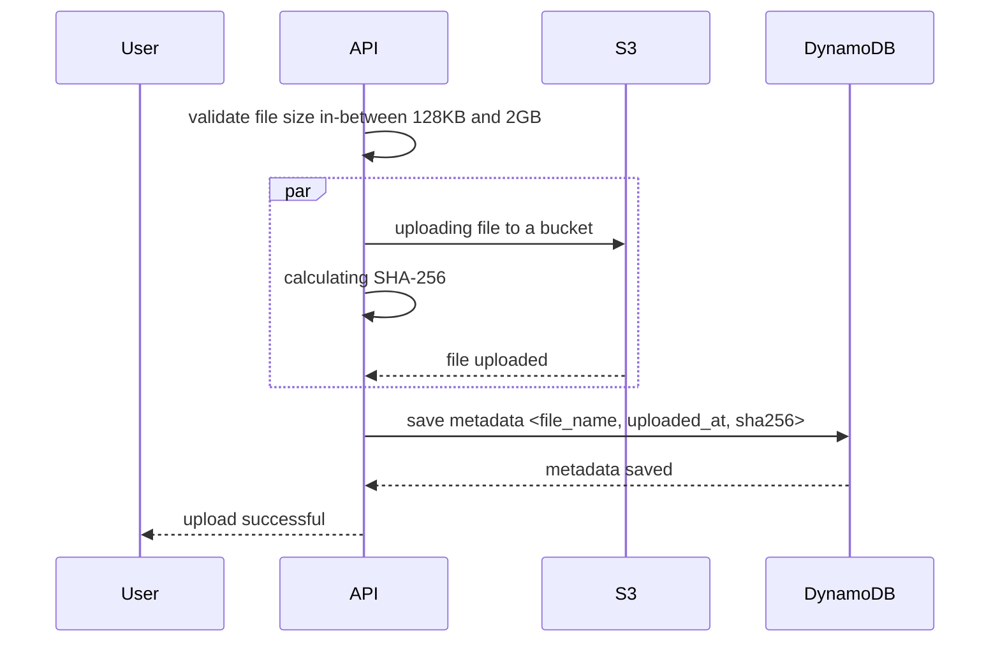

# Test Assignment for CPSF

This is a test assignment as part of the hiring process for WithSecure Cloud Protection for Salesforce.
This task is relevant to the job you are applying for. We hope you find this assignment both interesting and enjoyable.

Please read the instructions below carefully. If you are unsure about the requirements or have any problems or
questions related to the environment, please do not hesitate to contact the hiring manager. Happy coding!

## Introduction

The task is to demonstrate your abilities to design, develop, and test a small application that integrates AWS services
using C#. You are asked to build a simple file storage system. The system should allow users to upload, retrieve,
and list all stored files. For this exercise, environment with **LocalStack** is prepared to simulate AWS services
locally.

The task is to implement the following endpoints and integrate them with AWS resources:

| Endpoint      | Is Required | Description                                                                                                                                                                                                                                                                                                                                                                                                                                                                                                                                                                                                                                                                                                                                           |
|---------------|-------------|-------------------------------------------------------------------------------------------------------------------------------------------------------------------------------------------------------------------------------------------------------------------------------------------------------------------------------------------------------------------------------------------------------------------------------------------------------------------------------------------------------------------------------------------------------------------------------------------------------------------------------------------------------------------------------------------------------------------------------------------------------|
| Upload file   | ✅           | As a user, I want to upload a file to S3 for long-term storage. The file can be any size from 128KB to 2GB. Unfortunately, I have a slow internet connection, and sometimes there might be network interruptions, but we should still be able to upload files efficiently. Along with uploading file, I want to calculate its SHA-256 value and store it in DynamoDB for further analysis, but kindly asking you to consider two important points:<br/>1. Memory used. We have small servers, and cannot have more than 2GB of memory on a server.<br/>2. By security reasons we cannot store the whole file in-memory of the application, let's say even minimum size files (128KB) should not be stored in-memory, even for a fraction of a second. |
| Download file | ❌           | As a user, I want to download a file which was previously uploaded by me or any other user, and download process should be tolerable to network interruptions within 10 seconds, if possible.                                                                                                                                                                                                                                                                                                                                                                                                                                                                                                                                                         |
| List files    | ❌           | As a user, I want to list all files, and find specific files using their SHA-256 values. The logic should be reliable in case file was deleted from S3 but DynamoDB record still exist, it's ok to have not consistent state for a short time, when file was deleted in the middle of the request.                                                                                                                                                                                                                                                                                                                                                                                                                                                    |

An example of the sequence diagram for the upload file operation is provided below, to give you an idea of the flow.
Please, think about the design and implementation for the other endpoints. The diagram has only few details,
to give you a space for thinking and designing the system.
>Note: To view the diagram below, you may need to install the **Mermaid** plugin for your editor.



Pre-existing infrastructure:
- S3 bucket `s3://storage` for the file storage
- DynamoDB table `Files` with the `Filename` and `UploadedAt` as the default attribute. Feel free to change the schema. 
You can configure the table attributes in `init-scripts/init.sh` file then run `make reset` to apply the changes.
- ASP.NET Core Web API project with .NET SDK 8.0. You can find it in `FileStorage` folder, please use `FileStorage/Controllers/FileStorageController.cs` as a starting point,
feel free to change anything you need in the solution

Tech details:
- Write unit tests for critical components
- Use AWS SDK for .NET
- Authentication / Authorization is not a part of the test assignment
- Use your judgement what fields should be in the metadata stored in the DynamoDB table

## Getting started

Pre-requirements:
- Docker
- .NET SDK 8.0+
- make
- jq

### Setup
To setup the project and all needed dependencies:

```sh
make up
```

To test if everything is ready (DynamoDB and S3 are created):

```sh
make check
```

If everything worked fine (localstack takes a bit time to prepare), you should see the following output from
`make check` command:
```
*** You might see your own AWS resources below, if you have localstack installed before ***
DynamoDB Table: Files
S3 Bucket: storage
FileStorage API: Healthy
*******************************************************************************************
```

### Additional Commands

To restart localstack resources (and empty them) as well as building the docker image for `filestorage-api` container
```sh
make reset
```

To stop all containers
```sh
make down
```

To check logs from containers
```sh
make logs
```

To check all stored S3 files and DynamoDB items
```sh
make storage
```

## Expectations
Please consider the following points:
- The code should be clean and easy to read
- The application should start in docker without manual changes
- Unit tests for core functionality are written and passing
- Your decisions are well documented in the code or in a readme file

## Submission
- You can submit your solution as a zip file or a link to a public repository to a hiring manager email
